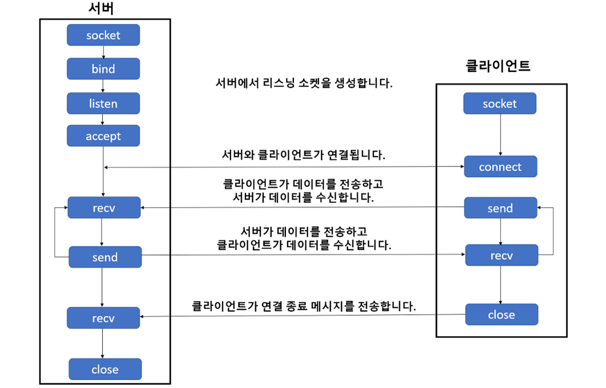

****

회사에서 Unity와 데이터 주고 받을 때 Docker container통신, 그리고 IP 카메라와 데이터 주고 받을 때 사용했는데

매번 할 때마다 왜 오류나고 난리인지..ㅠㅠ  

## 서버 통신

### 소켓 (socket)과 포트(port)

**소켓**은 소프트웨어로 작성된 다른 컴퓨터와 네트워크를 통해 ***\*데이터를 송수신하기 위한 창구\**** 역할을 하는 통신 접속점 

- 소켓을 구성한다는 것은 이웃과 연락할 수 있는 **전화기* **를 설치하는 것과 비슷한 개념 

데이터를 주고 받을 때 위의 그림에서 주황색으로 칠해진 socket 이라는 개념을 통해 데이터를 주고 받을 수 있음  

 

**포트(port)** 는 네트워크 상에서 통신하기 위해서 호스트 내부적으로 프로세스가 할당받아야 하는 고유한 숫자  

하나의 소켓은 여러개의 포트를 할당 받을 수 있음  

- 포트는 설치된 전화기로 연락하기 위해 필요한 특정한 **이웃에게 연결되어 있는 번호**   

 

 

#### 소켓 (Socket)

파이썬으로 **TCP(Transmission Control Protocol) 서버/클라이언트 프로그램**을 작성할 때 사용하는 표준 라이브러리  

 

socket 의 TCP에 대한 소켓 API 호출 순서와 데이터 플로우

 {: .align-center .img-width-half}

- 소켓과 포트를 bind 즉, 연결

- listen -> 어떤 client 들이 접속해 있는지 듣고 있음

- clinet가 서버과 연결을 하기 위해 connect라는 것을 보냄 

- 서버가 accept 하게 되면 연결이 이루어짐 

- client가 어떤 데이터나 signal을 send 

- 서버가 receive를 통해 값을 받아 처리를 함 

- 처리된 결과를 다시 client에게 보내줌

- client가 close를 하면 signal을 받아 close를 함

 

### Signal

